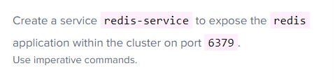
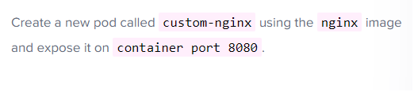

- 쿠버네티스에서 가장 작은 단위

- 주요 명령어
```
##nginx 이미지의 pod 하나만 생성
kubectl run nginx --image=nginx 
## 그 이미지를 80 port로 외부로 노출(NodePort)
kubectl expose pod nginx --port 80 --type NodePort (그 이미지를 80 port로 외부로 노출(NodePort))
```  

- ex) Pod.yml
```
apiVersion: v1
kind: Pod
metadata:
  name: nginx
  labels:
    app: nginx
    tier: frontend
spec:
  containers:
  -  name: nginx
     image: nginx

```

- problem

```
kubectl expose redis --port 6379 --name= redis-service
```

```
kubectl run custon-nginx --image= nginx --port 8080
```