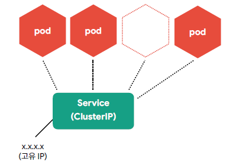
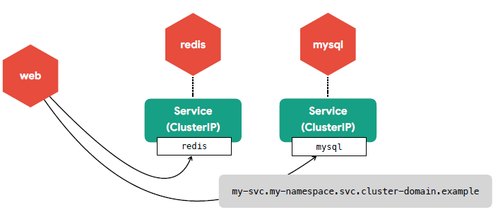
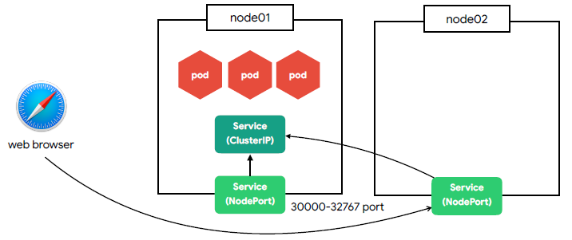
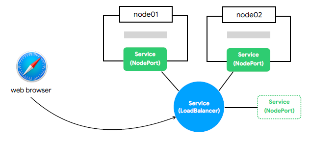
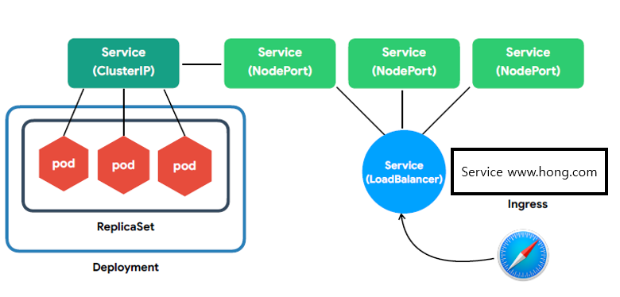

1. Cluster IP

- 클러스터 내부에서 사용하는 프록시
- Pod은 동적이지만 서비스는 고유 IP를 가짐

- 클러스터 내부에서 서비스 연결은 DNS를 이용

2. NodePort

- 노드(host)에 노출되어 외부에서 접근 가능한 서비스
- 모든 노드에 동일한 포트로 생성
3. LoadBalancer

- 하나의 IP 주소를 외부에 노출
- 균등한 배분, 접근...

4. 그외
- Ingress - 도메인 또는 경로별 라우팅 (Nginx, HAProxy, ALB ...)
- Volume - Storage(EBS, NFS ...)
- Namespace - 논리적인 리소스 구분
- ConfigMap/Secret - 설정
- ServiceAccount - 권한 계정
- Role/ClusterRole - 권한 설정 (get, list, watch, create ...)

5. 전반적인 그림
