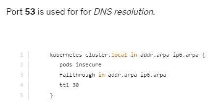
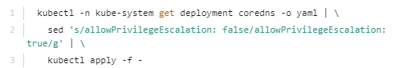

- cni-bin-dir :    Kubelet은 시작 시 플러그인에 대해 이 디렉토리를 조사합니다 .

- network-plugin: cni-bin-dir에서 사용할 네트워크 플러그인입니다. 플러그인 디렉토리에서 검색된 플러그인이 보고한 이름과 일치해야 합니다.
```
kubectl apply -f "https://cloud.weave.works/k8s/net?k8s-version=$(kubectl version | base64 | tr -d '\n')"
kubectl apply -f               https://raw.githubusercontent.com/coreos/flannel/2140ac876ef134e0ed5af15c65e414cf26827915/Documentation/kube-flannel.yml

curl https://docs.projectcalico.org/manifests/calico.yaml -O  
kubectl apply -f calico.yaml 
  
```


```
proxy . /etc/resolv.conf
```
coreDNS와 관련된 문제 해결
1. 보류 상태의 CoreDNS 포드를 찾으면 먼저 네트워크 플러그인이 설치되어 있는지 확인합니다.

2. coredns 포드에 CrashLoopBackOff 또는 오류 상태 가 있음

이전 버전의 Docker와 함께 SELinux를 실행하는 노드가 있는 경우 coredns 팟(Pod)이 시작되지 않는 시나리오가 발생할 수 있습니다. 이 문제를 해결하려면 다음 옵션 중 하나를 시도해 보세요.

a) 최신 버전의 Docker로 업그레이드합니다.

b) SELinux를 비활성화합니다 .

c) allowPrivilegeEscalation 을 true 로 설정하도록 coredns 배포를 수정합니다 .

d) CoreDNS에 CrashLoopBackOff 가 있는 또 다른 원인은 Kubernetes에 배포된 CoreDNS Pod가 루프를 감지하는 경우입니다.

kube-proxy와 관련된 문제 해결
1. kube-system 네임스페이스 의 kube -proxy 포드 가 실행 중인지 확인합니다.

2. kube-proxy 로그를 확인합니다.

3. configmap 이 올바르게 정의되어 있고 kube-proxy 바이너리를 실행하기 위한 구성 파일이 올바른지 확인합니다.

4. kube-config 는 config map 에 정의되어 있습니다 .

5. kube-proxy 가 컨테이너 내부에서 실행 중인지 확인합니다.(netstat -plan | grep kube-proxy)
6. 