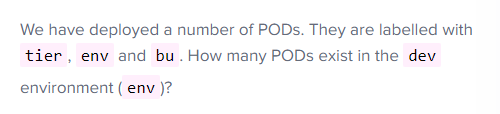

- 그룹화, 다른 범주별로 다른 object를 필터링 하는 방법


- metadata - labels에서 key value 형태로 가짐
```
apiVersion: v1
kind: Pod
metadata:
  name: nginx
  labels:
    app: nginx
    tier: frontend
spec:
  containers:
  -  name: nginx
     image: nginx

```

```
kubectl get pods --selector app=nginx

```

```
apiVersion: apps/v1   (이거 주의해야함)
kind: ReplicaSet

metadata:
  name: simple-webapp
  labels:
    app: App1
    type: front-end
  annotations:
    buildversion: 1.34

spec:
  replicas: 3
  selector:
    matchLabels:
      type: App1 (아래 app: App1이랑 같아야함)
  template:
    metadata:
      name: nginx
      labels:
        app: App1
        tier: front-end
    spec:
      containers:
      -  name: nginx
         image: nginx
replicas: 3
selector:
  matchLabels:
    type: front-end 
```


```
kubectl get pods --selector env=dev --no-headers | wc -l
```