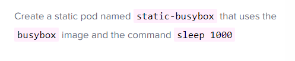
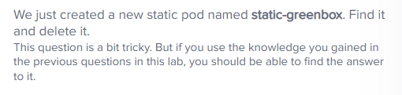

- kube-api가 없이 kubelet에 pod 형성
- 서버의 디렉토리에서 yaml 파일을 읽도록 kubelet 구성 가능
- 일반적으로 /etc/kubernetes/manifest
- static pod은 해당 노드에서 docker ps 로 확인 가능
- 또한 API server는 kubelet에 의해 생성된 static pod를 인식함
- 클러스터의 일부인 경우 kube api server에 mirror object를 생성(read-only, 삭제불가)
DaemonSets vs Static PODs
- DaemonSets: created by Kube-API server(DaemonSet Controller), Deploy Monitoring Agents, Logging Agents on nodes
- Static PODs: Created by Kubelet, Deploy Control Plane components as Static Pods
공통점은 Ignored by the Kube-Scheduler

```
# Q) How many static pods exist in this cluster in all namespaces?
kubectl get pod -A
# pod 중에 -controlplane 붙은거
```
```
#static pod를 만들기 위한 디렉토리 찾기
ps -aux | grep kubelet

--config 붙은거 찾아야함(여기서는 /etc/kubernetes/manifest)
```


```
kubectl run static-busybox --image=busybox --dry-run=client -o yaml --command -- sleep 1000 > ./test.yaml
```
- 다른 노드에 static pod으로 형성되어 있는 경우

```
해당 노드로 ssh 접속
ps -aux | grep kubelet
--config 경로 확인
거기에 있는 yaml 파일 확인해서 static pod를 어디서 만드는지 확인
static pod 위치 들어가서 그냥 파일 삭제하면 됨. 다른 명령어 필요없음  
```