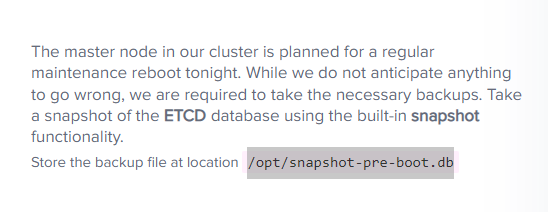
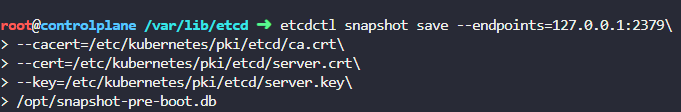
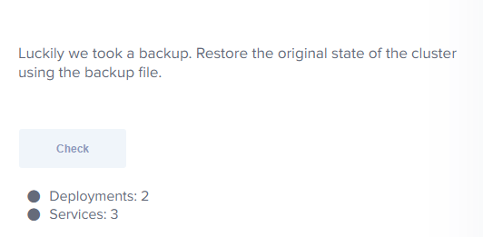
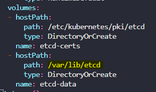

```
kubectl get all -all-namespaces -o yaml > all-deploy-services.yaml
```

- etcd: 클러스터 상태에 대한 정보 저장, 클러스터 자체, 노드 및 클러스터 내에서 생성된 기타 모든 리소스에 대한 정보
- 자체 스냅샷 솔루션이 내장되어 있음
```
export ETCDCTL_API=3
etcdctl snapshot save -h
etcdctl snapshot restore -h
```





```
etcdctl snapshot restore --data-dir /var/lib/etcd-backup /opt/snapshot-pre-boot.db
# 그리고 yaml파일에서 volumes hostPath를 위에 --data-dir로 바꿔줘야함 
```
