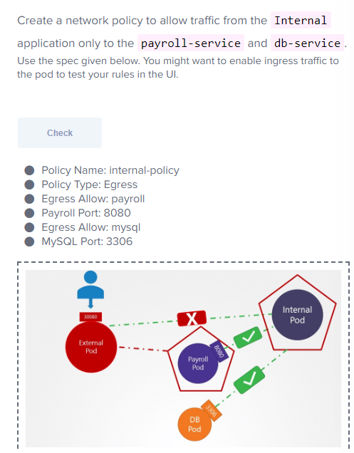

- Ingress 수신, Egress 발신
- Network Policy : Allow Ingress Traffic From API Pod on Port 3306
```
policyTypes:
- Ingress
ingress:
- from:
  - podSelector:
      matchLabels:
        name: api-pod
  ports:
  - protocol: TCP
    port: 3306
```

```
apiVersion: networking.k8s.io/v1
kind: NetworkPolicy
metadata:
  name: db-policy
spec:
  podSelector:
    matchLabels:
      role: db
  policyTypes:
  - Ingress
  ingress:
  - from:
    - podSelector:
        matchLabels:
          name: api-pod
      namesspaceSelector:
        matchLabels:
          name: prod
    - ipBlock:
        cidr: 192.168.5.10/32
    ports:
    - protocol: TCP
      port: 3306
```
- namespaceSelector 설정을 안해주면 namespace에 관계 없이 일치하는 label만 있으면 접근 가능
- podSelector를 설정안하면 특정 namespace 내의 모든 pod이 db에 접근 가능 
```
- podSelector:
        matchLabels:
          name: api-pod
- namesspaceSelector:
        matchLabels:
          name: prod
- ipBlock:
        cidr: 192.168.5.10/32
```
- 이렇게 작성하면 별도의 규칙이 된다.
```
apiVersion: networking.k8s.io/v1
kind: NetworkPolicy
metadata:
  name: db-policy
spec:
  podSelector:
    matchLabels:
      role: db
  policyTypes:
  - Ingress
  ingress:
  - from:
    - podSelector:
        matchLabels:
          name: api-pod
    ports:
    - protocol: TCP
      port: 3306
      
    egress:
    - to:
      - ipBlock:
          cidr: 192.168.5.10/32
      port:
      - protocol: TCP
        port: 80
```


```
apiVersion: networking.k8s.io/v1
kind: NetworkPolicy
metadata:
  name: internal-policy
  namespace: default
spec:
  podSelector:
    matchLabels:
      role: internal
  policyTypes:
    - Egress
    - Ingress
  egress:
    - to:
        - podSelector:
            matchLabels:
              name: payroll
      ports:
        - protocol: TCP
          port: 8080

    - to:
        - podSelector:
            matchLabels:
              name: mysql
      ports:
        - protocol: TCP
          port: 3306
```