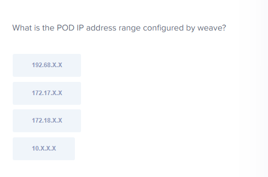

- pod 계층 네트워크
```
/etc/cni/net.d
/opt/cni/bin
```
- 각 노드에 weave CNI 플러그인이 클러스터에 배포되면 각 노드에 에이전트 또는 서비스를 배포
- 그들은 서로 정보를 교환하기 위해 서로 통신
- weave는 Pod가 에이전트에 도달하도록 올바른 경로를 가져오는지 확인, 그 후 다른 Pod의 에이전트가 처리

The CNI binaries are located under /opt/cni/bin by default. 여기없는 sh은 못쓴다

```
ip addr | grep weave
```