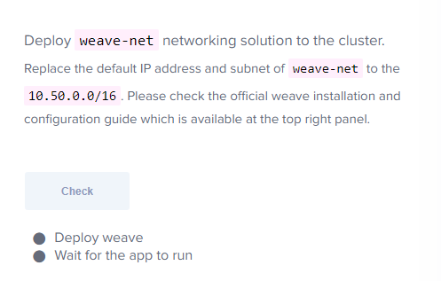

- weave-net의 기본 IP대역은 10.32.0.0/12라서 호스트 시스템 ip address와 겹친다
- 대역을 바꿔줘야함
```
# 끝에 env로 대역 수정
kubectl apply -f "https://cloud.weave.works/k8s/net?k8s-version=$(kubectl version | base64 | tr -d '\n')&env.IPALLOC_RANGE=10.50.0.0/16"
```