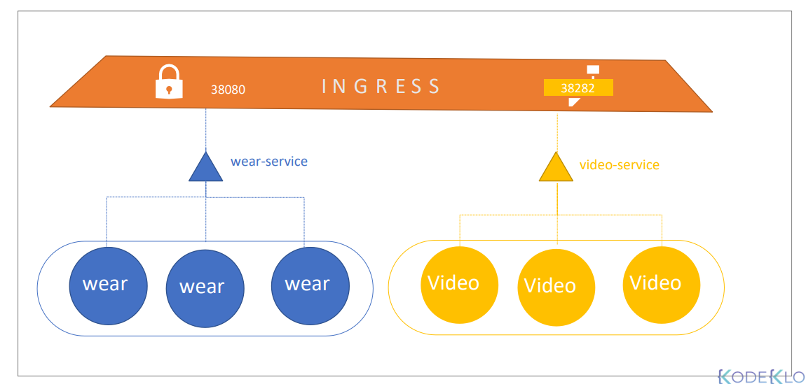

- 로드밸런싱, 인증, SSL, URL 수행
- nginx-ingress 이미지 배포, 이를 노출하는 서비스, ConfigMap, ServiceAccount
```
apiVersion: extensions/v1beta
kind: Ingress
metadata:
  name: ingress-wear
spec:
  backend:
    seviceName: wear-service
    servicePort: 80
```

```
apiVersion: extensions/v1beta
kind: Ingress
metadata:
  name: ingress-wear-watch
spec:
  rules:
  - host: wear.my-online-store.com  
    http:
      paths:
      - path: /wear
        backend:
          seviceName: wear-service
          servicePort: 80
  - host: wear.my-online-store.com  
    http:
      path: /watch
      backend:
        seviceName: watch-service
        servicePort: 80
```

```
kubectl create ingress <ingress-name> --rule="host/path=service:port"
http://<ingress-service>:<ingress-port>/watch-->http://<watch-service>:<port>/

http://<ingress-service>:<ingress-port>/wear-->http://<wear-service>:<port>/


```