- network namespace, docker networking 기초
1. switch routing
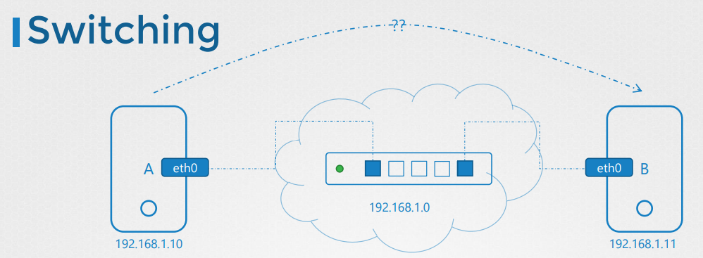
- A와 B를 스위치에 연결하고 스위치는 연결할 두 시스템을 포함하는 네트워크를 만듬
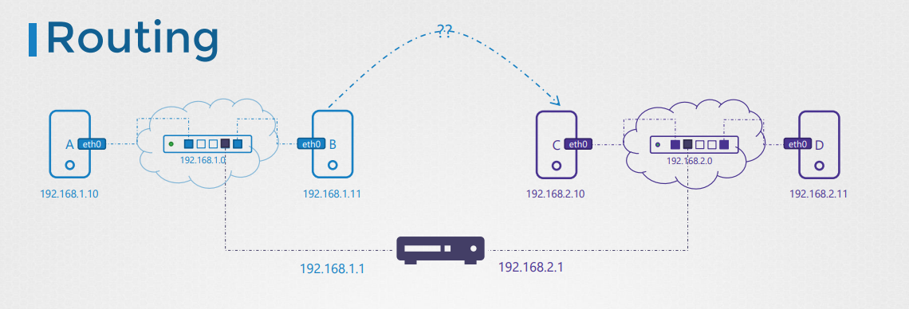
- 라우터는 두개의 네트워크를 연결하는 사용
- Gateway
Gateway의 0.0.0.0 은 게이트웨이가 필요하지 않음을 나타냄
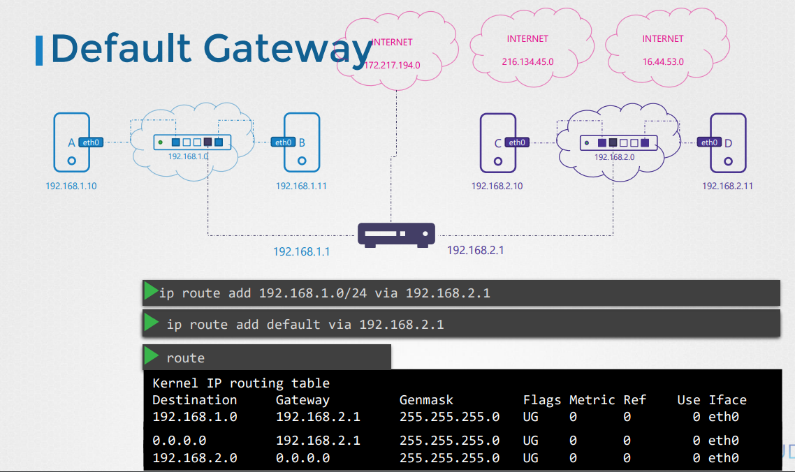
```
ip rout add 192.168.2.0/24 via 192.168.1.1  
```
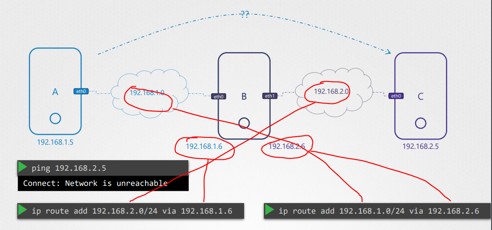
- B가 라우팅 역할
- 하지만 기본적으로 리눅스 네트워크 체계에서는 저렇게 연결된 것처럼 보이지만 데이터 송수신을 허용안함
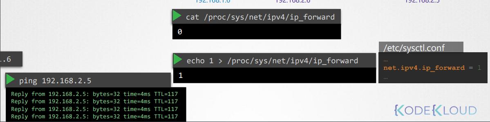
- 그림과 같이 별도의 forward 허용을 해줘야 함
```
ip link: 호스트의 인터페이스를 나열
ip addr: 해당 인터페이스에 할당된 ip주소를 확인
ip addr add: 인터페이스에 IP주소를 설정하는데 사용
ip route 라우팅 테이블과 ip경로 확인
ip route add 라우팅 테이블에 추가
cat /proc/sys/net/ipv4/ip_forward가 1이어야 ip전달 활성화됨
```
3. DNS
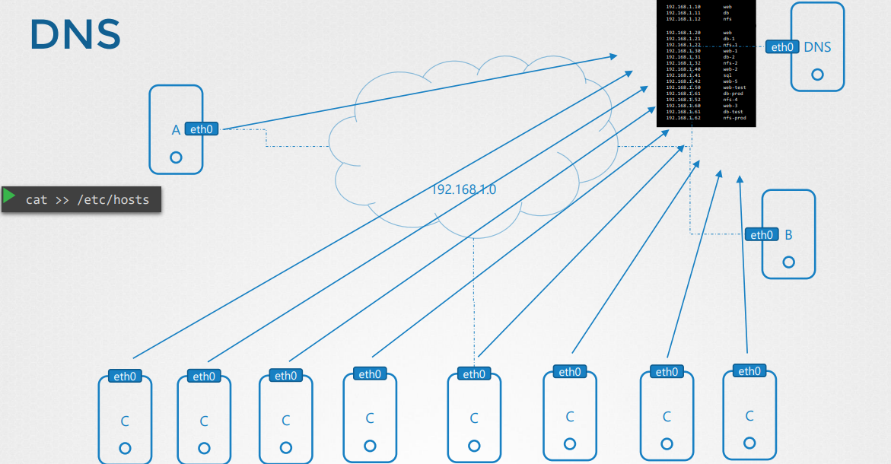
- etc/hosts 의 내용이 많아지면 관리하기가 힘들어지기때문에 DNS를 관리하는 서버를 만들어 참조하도록함
- /etc/resolv.conf에 nameserver에 입력해주면됨
- 호스트명을 바꾸고 싶을 때 DNS 서버만 수정해주면 전부 반영됨
- local /etc/hosts와 nameserver에 같은 이름이 있으면, local에 있는 정보를 먼저 참조함. 없을 시 nameserver 참조
- /etc/nsswitch.conf의 hosts 내 내용 순서를 바꿔주면 우선순위가 바뀜
- nameserver 8.8.8.8은 구글에서 호스팅하는 인터넷에서, 사용할 수 있는 일반적인 공개 이름 서버 ((ex)www.facebook.com)
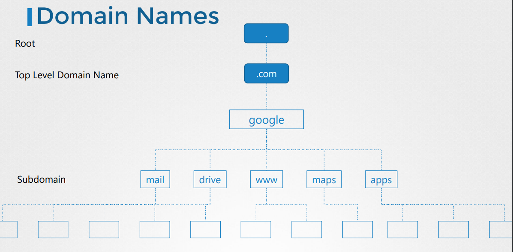
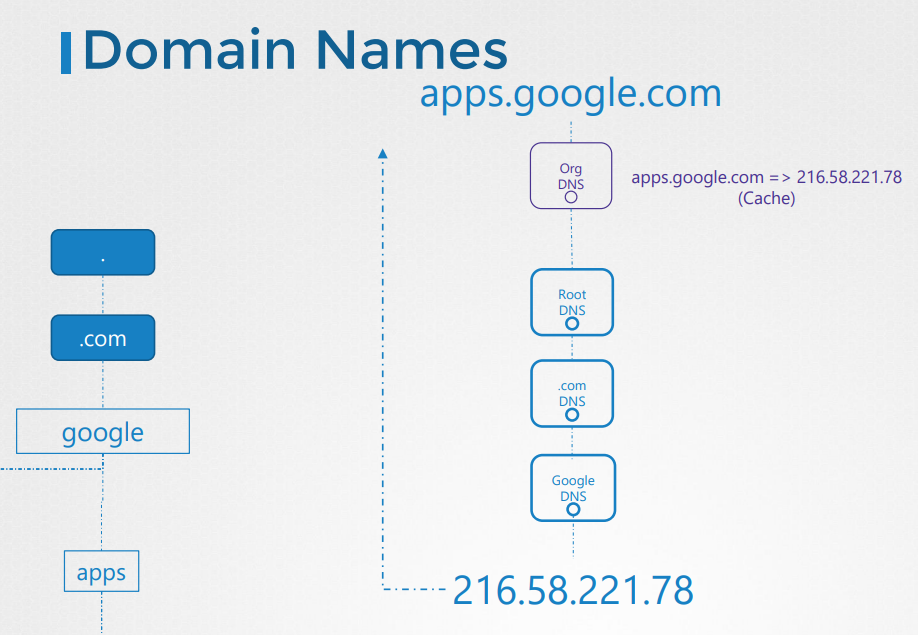

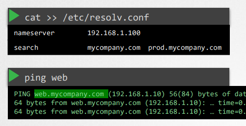
- web이라는 DNS가 없으면 당연히 ping이 안간다
- resolv.conf에 search 영역을 그림과 같이 작성하면 ping web이 저절로 web.mycompany.com으로 가는 것을 볼 수 있다.
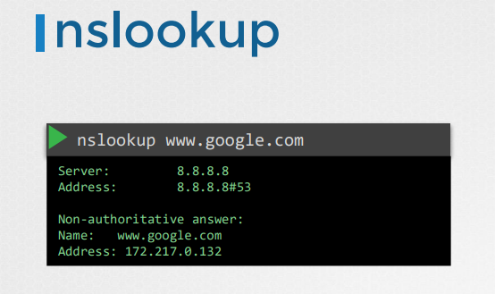
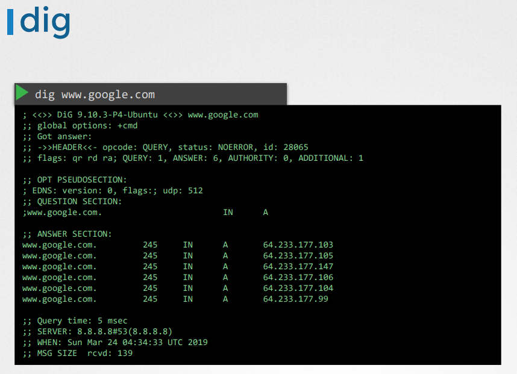
6. network namespace
7. docker networking
8. CNI