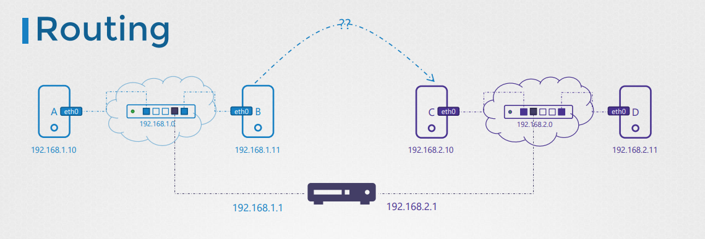
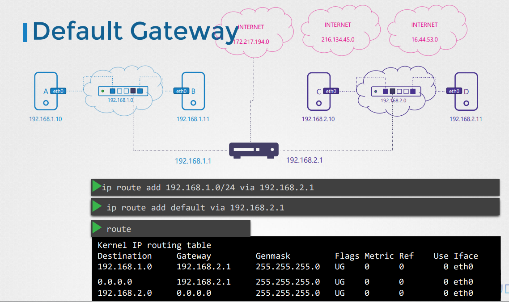
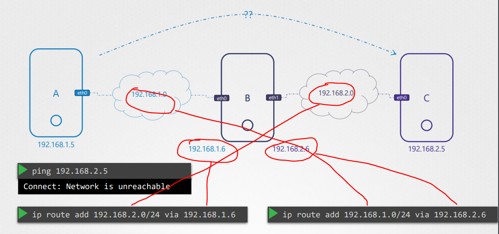
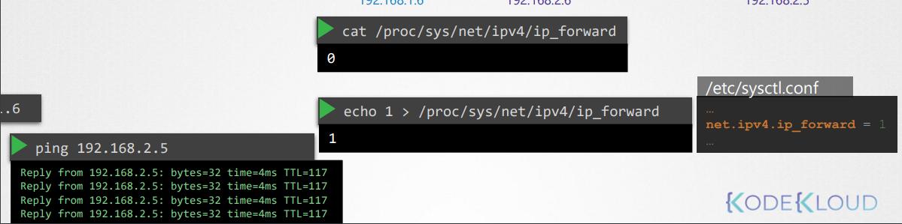
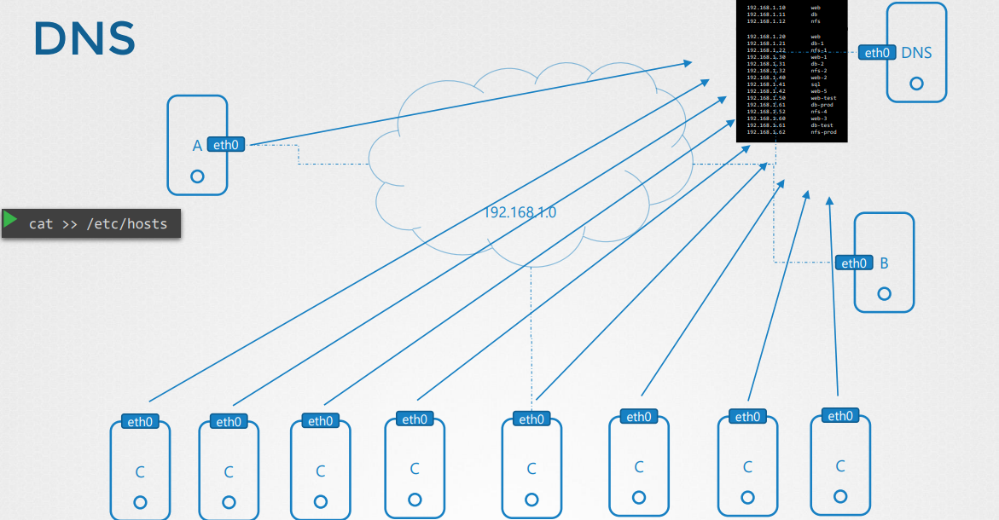
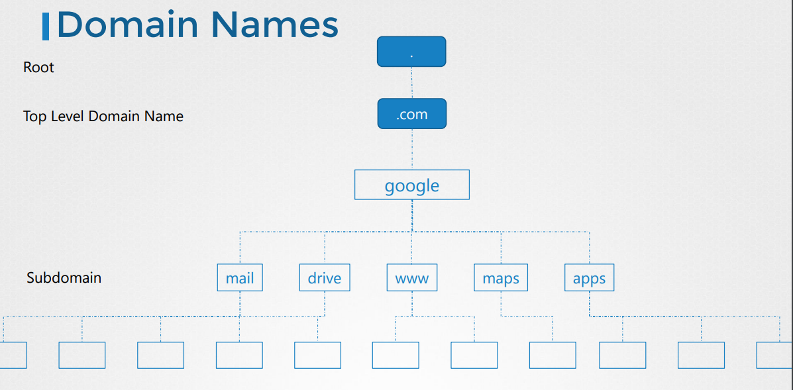
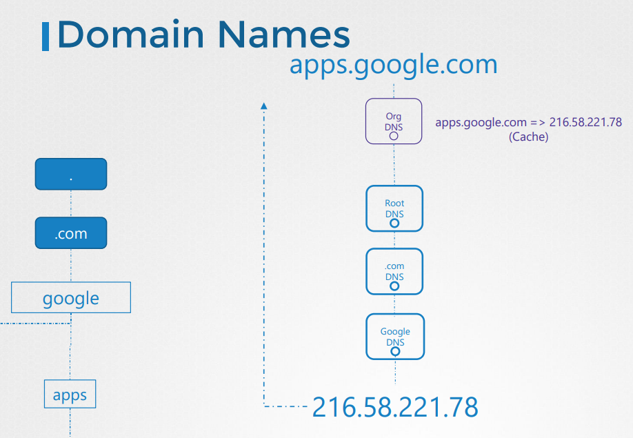
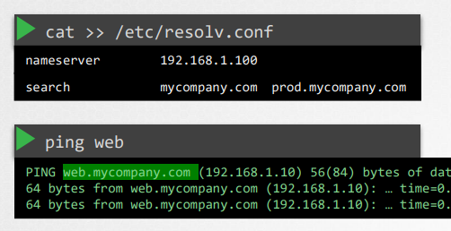
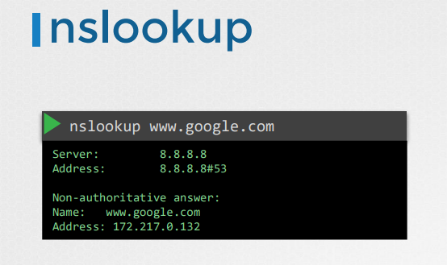
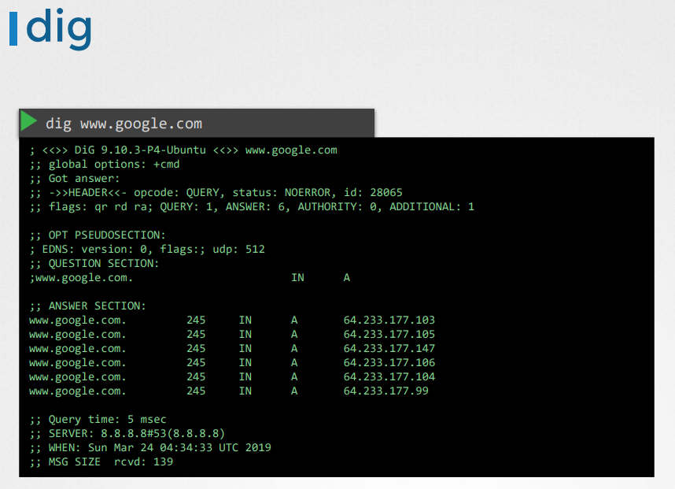

- network namespace, docker networking 기초
1. switch routing

- A와 B를 스위치에 연결하고 스위치는 연결할 두 시스템을 포함하는 네트워크를 만듬

- 라우터는 두개의 네트워크를 연결하는 사용
- Gateway
Gateway의 0.0.0.0 은 게이트웨이가 필요하지 않음을 나타냄

```
ip rout add 192.168.2.0/24 via 192.168.1.1  
```

- B가 라우팅 역할
- 하지만 기본적으로 리눅스 네트워크 체계에서는 저렇게 연결된 것처럼 보이지만 데이터 송수신을 허용안함

- 그림과 같이 별도의 forward 허용을 해줘야 함
```
ip link: 호스트의 인터페이스를 나열
ip addr: 해당 인터페이스에 할당된 ip주소를 확인
ip addr add: 인터페이스에 IP주소를 설정하는데 사용
ip route 라우팅 테이블과 ip경로 확인
ip route add 라우팅 테이블에 추가
cat /proc/sys/net/ipv4/ip_forward가 1이어야 ip전달 활성화됨
```
2. DNS

- etc/hosts 의 내용이 많아지면 관리하기가 힘들어지기때문에 DNS를 관리하는 서버를 만들어 참조하도록함
- /etc/resolv.conf에 nameserver에 입력해주면됨
- 호스트명을 바꾸고 싶을 때 DNS 서버만 수정해주면 전부 반영됨
- local /etc/hosts와 nameserver에 같은 이름이 있으면, local에 있는 정보를 먼저 참조함. 없을 시 nameserver 참조
- /etc/nsswitch.conf의 hosts 내 내용 순서를 바꿔주면 우선순위가 바뀜
- nameserver 8.8.8.8은 구글에서 호스팅하는 인터넷에서, 사용할 수 있는 일반적인 공개 이름 서버 ((ex)www.facebook.com)




- web이라는 DNS가 없으면 당연히 ping이 안간다
- resolv.conf에 search 영역을 그림과 같이 작성하면 ping web이 저절로 web.mycompany.com으로 가는 것을 볼 수 있다.


3. network namespace
- namespace는 docker와 같은 컨테이너에서 네트워크 격리를 구현하는데 사용
```
# 네임스페이스 추가
ip netns add red
ip netns add blue
# 조회
ip netns
ip netns exec red ip link = ip -n red link

ip link add veth-red type veth peer name veth-blue
ip link set veth-red netns red
ip link set veth-blue netns blue

ip -n red addr add 192.168.15.1 dev veth-red
ip -n blue addr add 1992.168.15.2 dev veth-blue

ip -n red link set veth-red up
ip -n blue link set veth-blue up

ip netns exec red ping 192.168.15.2 (작동함)
ip netns exec red arp (veth-red 조회가능)

# host에서 arp 명령어를 치면 정보가 안나옴. 생성한 인터페이스에 대해서는 전혀 모름

# 두 개 그 이상의 네임스페이스가 존재할 때 서로 통신하게 하는 법 -> 가상 네트워크 필요(가상 스위치)
ip link add v-net-0 type bridge
ip link (위 명령어에서 생성한 v-net-0의 정보가 나옴)
ip link set dev v-net-0 up (막 생성하면 down되어있기에 up시켜줘야함)
v-net-0는 인터페이스와 네임스페이스를 위한 스위치로 생각 가능
그 다음 절차로는 각 네임스페이스를 브리지 네트워크에 연결 할 케이블이 필요
ip -n red link del veth-red (아까 생성한 link삭제, 그들은 한쌍이기 때문에 하나만 삭제해도 둘다 삭제됨)
ip link add veth-red type veth peer name veth-red-br (새로운 케이블 생성)
ip link add veth-blue type veth peer name veth-blue-br
ip link set veth-red netns red(네임스페이스 연결)
ip link set veth-blue netns blue
ip link set veth-red-br master v-net-0 (네임스페이스와 브릿지 연결)
ip link set veth-blue-br master v-net-0

ip -n red addr add 192.168.15.1 dev veth-red
ip -n blue addr add 1992.168.15.2 dev veth-blue
ip -n red link set veth-red up
ip -n blue link set veth-blue up

ping 192.168.15.1 (작동안함)
# 브리지 스위치는 호스트에 대한 네트워크 인터페이스임 -> ip 주소 할당
ip addr add 192.168.15.5/24 dev v-net-0
ping 192.168.15.1 (작동함)

# 이 네트워크는 여전히 비공개 상태이며 호스트 내에서 제한
# 외부로 통하는 유일한 문은 호스트의 이더넷 포트
# 다른 host에 ping을 날려도 요청이 안감
# 로컬호스트를 v-net-0과 LAN을 연결하는 게이트웨이로 사용
ip netns exec blue ip route add 192.168.1.0/24(LAN) via 192.168.15.5

iptable -t nat -A POSTROUTING -s 192.168.15.0/24 -j MASQUERADE (포스트 라우팅 체인의 net IP 테이블에 새규칙을 추가)
ip netns exec blue ping 192.168.1.3

ip netns exec blue ping 8.8.8.8 (연결안됨)

ip netns exec blue ip route add default via 192.168.15.5 (default gateway 추가)
ip netns exec blue ping 8.8.8.8 (연결됨)

다른 호스트에서 namespace에 ping 안됨
1. 사설망 ID를 두 번째 호스트에 제공
2. 포트포워딩
iptable -t nat -A PREROUTING --dport 80 --to-destination 192.168.15.2:80 -j DNAT
```
4. docker networking
```
docker run nginx 
# 컨테이너는 각각의 ip를 부여받음 ex) 172.17.0.2
# bridge 172.17.0.0 (docker network ls치면 bridge로 나오고 ip link 검색을 하면 docker0로 나옴)
ip link add docker0 type bridge


```
5. CNI